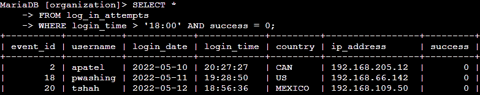
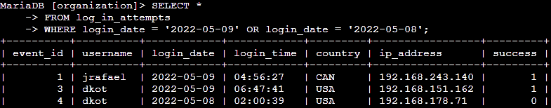
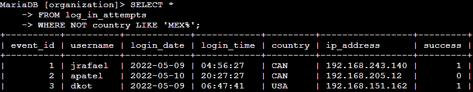
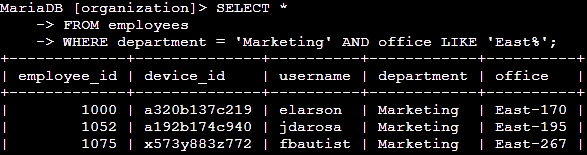
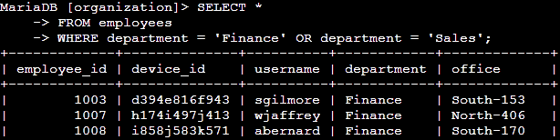
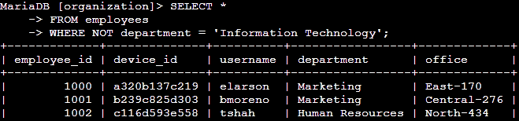

# Apply Filters to SQL Queries

## Project scenario

In this project, I will investigate security issues within a large organization.

Several suspicious login attempts occurred within the organization. My supervisor tasked me with examining the organization's data in the `employees` and `log_in_attempts` tables using SQL queries and filters.

> Output from each SQL query is shortened for brevity.

## Retrieve after hours failed login attempts

A potential security incident occurred after business hours (18:00). 

I used the following SQL query of the log_in_attempts table to investigate failed logins after business hours.

 

> The `AND` operator is used to filter based on whether two conditions are true.

Query breakdown:
- Select all columns: `SELECT *`
- From the log_in_attempts table: `FROM log_in_attempts`
- Where login time is greater than 18:00: `WHERE login_time > '18:00'` 
- And the login was not successful (0 indicates false): `AND success = 0;`

## Retrieve login attempts on specific dates

A suspicious event occurred on 2022-05-09.

To investigate the day of the event (2022-05-09) and the day before (2022-05-08), I used the following SQL query.

 

> To filter based on whether one or both conditions are true, the `OR` operator is used.

Query breakdown:
- Select all columns: `SELECT *`
- From the log_in_attempts table: `FROM log_in_attempts`
- Where login date is 2022-05-09: `WHERE login_date = '2022-05-09'`
- Or login date is 2022-05-08: `OR login_date = '2022-05-08';` 

## Retrieve login attempts outside of Mexico

The security team determined suspicious activity with login attempts didn't originate from Mexico. 

To filter login attempts outside of Mexico, I'll use the `LIKE` operator and a percent sign (`%`) to filter based on a pattern. The `%` is a wildcard that substitutes for any amount of other characters. In this case, the pattern is `MEX%`. The `MEX%` pattern, combined with the `NOT` operator, filters out MEX and Mexico.

 

> To negate a condition in SQL, use the `NOT` operator.

Query breakdown:
- Select all columns: `SELECT *`
- From the log_in_attempts table: `FROM log_in_attempts`
- Where the country is not MEX or any other strings that start with MEX: `WHERE NOT country LIKE 'MEX%';`

## Retrieve employees in Marketing

The security team wants to perform security updates on particular employee machines in the Marketing department. I will need to query the `employees` table to send the appropriate data to the team.

To filter based on employees within the Marketing department and on the East side of the office, I used the following query.

 

Query breakdown:
- Select all columns: `SELECT *`
- From the employees table: `FROM employees`
- Where the employees are in the Marketing department: `WHERE department = 'Marketing'`
- And are in the East side of the office: `AND office LIKE 'East%';`

## Retrieve employees in Finance or Sales

A different security update is required for employees in the Finance and Sales departments.

The following query returns employees in the Finance and Sales departments.

 

Query breakdown:
- Select all columns: `SELECT *`
- From the employees table: `FROM employees`
- Where the employees are in the Finance department: `WHERE department = 'Finance'`
- Or are in the Sales department: `OR department = 'Sales';`

## Retrieve all employees not in IT

Lastly, the security team needs to make one more update to employee machines. All employees in the Information Technology department already have the update.

To return all employees of the organization, except those in the IT department, I used the following query.

 

Query breakdown:
- Select all columns: `SELECT *`
- From the employees table: `FROM employees`
- Where the employees are not in the Information Technology department: `WHERE NOT department = 'Information Technology';`

## Summary

In conclusion, I successfully examined suspicious logins within the organization using SQL filters and queries. The `AND`, `OR`, and `NOT` logical operators allowed me to conditionalize queries. Using the `LIKE` operator and the `%` wildcard permitted searching for patterns. I also queried specific employees whose machines required security updates.
